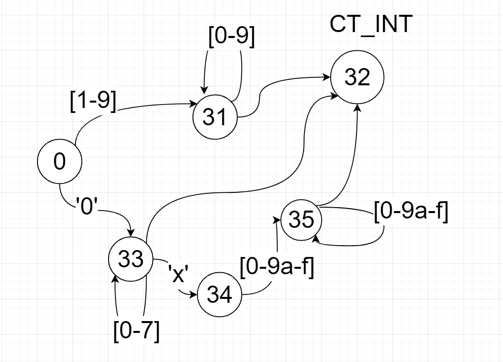
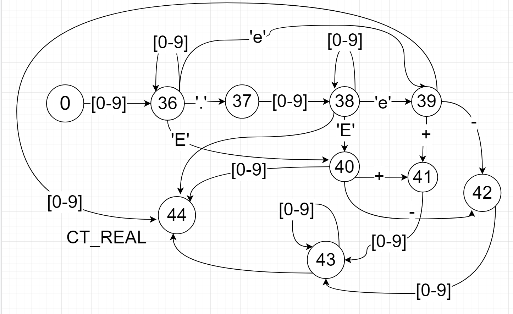

# Compilation-Tehniques
## Scope of this project
-------------
- Implementing a 'compiler' in C++ which follows the lexical rules of the AtomC
- These rules can be found here: https://sites.google.com/site/razvanaciu/atomc---lexical-rules 

## DFA's
----------------------
- ## **Delimiters**: 

- ## **Operators + Comments**: 

- ## **CT_INT**:

- ## **CT_REAL**:

- ## **CT_CHAR**:

- ## **CT_STRING**:

