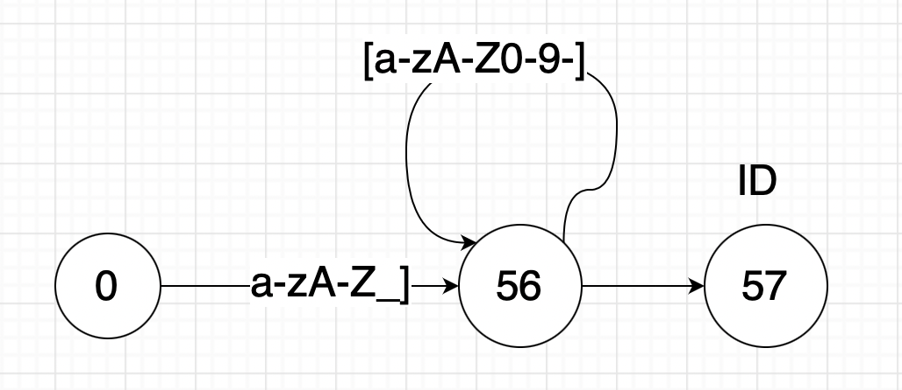
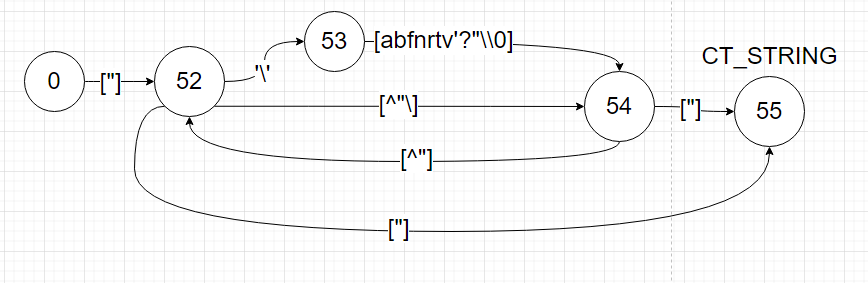

# Compilation-Tehniques
## Scope of this project
-------------
- Implementing a 'compiler' in C++ which follows the lexical rules of the AtomC
- These rules can be found here: https://sites.google.com/site/razvanaciu/atomc---lexical-rules 

## HOW TO RUN THE PROJECT
-------

    - In order to run this project I am using 2 scripts, one is called diff_build.sh( we run this one after we compiled the project for the first time) and 'run.sh' ( this script creates the entire build directory and it is really time consuming, recommended to run it only the first time).
    - If you want to change the file tested you can go into Utils.cpp, in the 'test_diagrams()' method, and call the 'test_file(file_name)' method with your own file.
    - If you don't want to run the VM you can comment the 'syn.run_vm()' line from the 'test_file(file_name)' method.

    -  NOTE: prerequisites:
        - Minimum 3.16.3 Version of CMake
        - Minimum gnu 9.1
        - Standard gcc version for this project is CXX_17 (features from CXX_17 such as std::variant are used, the project won't compile otherwise)
        - For any other details you can check CmakeLists.txt.
## DFA's
----------------------

- **ID DIAGRAM**

- **DELIMITERS**

- **CT_REAL_INT DIAGRAM**

- **CT_CHAR DIAGRAM**

- **CT_STRING DIAGRAM**

## SYNTACTIC ANALYZER
------------------------

## SYMBOL TABLE
------------------------

## VIRTUAL MACHINE
------------------------

## CODE GENERATION
------------------------
# NOTE

- In order to print my TokenList I am using a github project called: "VariadicTabel.hpp" which
can be find on the following link: https://github.com/friedmud/variadic_table
